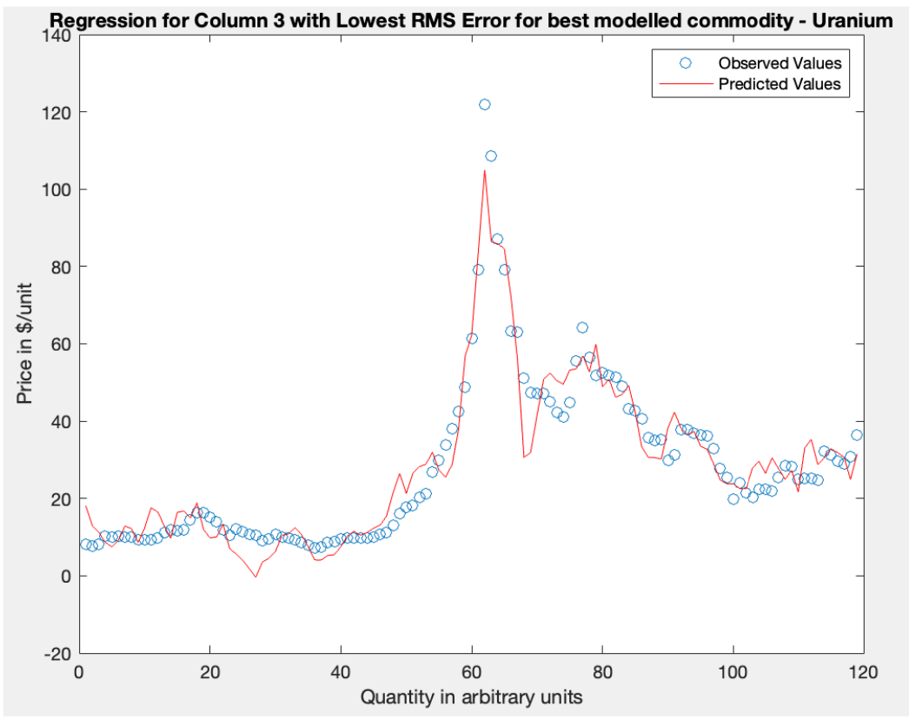

# Proxy Hedging in the Mineral Markets using Cross Validation of Linear Regression

The purpose of this exploration was to use Linear Regression and K-Fold Cross Validation techniques to evaluate the best proxy commodity in a given financial dataset for a particular market.

We first use the input dataset, goods.csv, to output the the Root Mean Square error values of the linear regressions for each commodity based on
predicted values calculated using other commodities as independent variables. 

We then find the index of the commodity with the lowest RMS Error value and conduct a 5-fold Cross Validation producing training and testing sets from
different partitions of data, and their respective RMS Errors.

This algorithmic model is well suited for the variables in the given dataset, goods.csv, but likely not entirely suitable for datasets with high variance which would produce relatively skewed output, biasing interpretation of real-world data.

    

